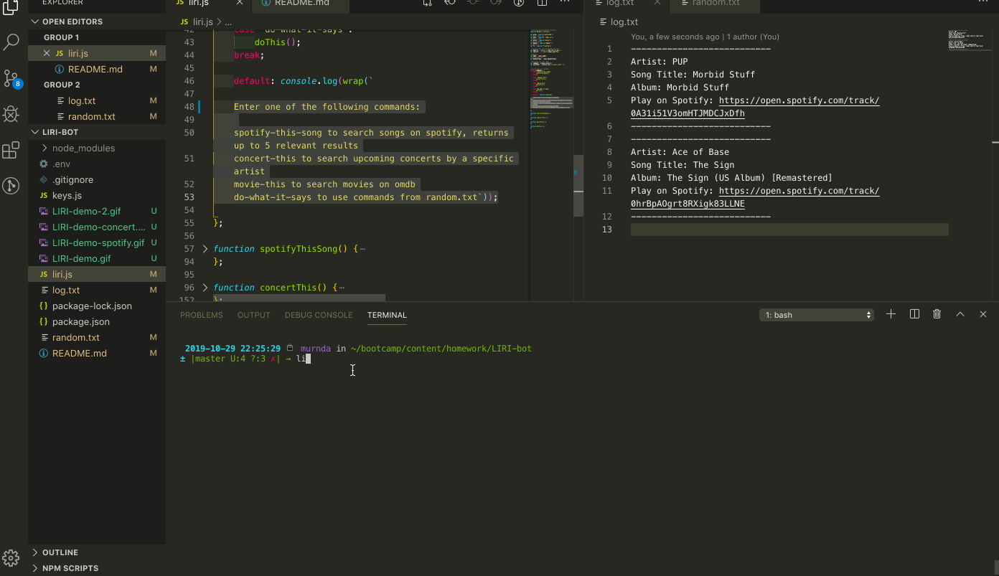

# LIRI-bot

## Description

LIRI is like iPhone's SIRI. However, while SIRI is a Speech Interpretation and Recognition Interface, **LIRI** is a *Language* Interpretation and Recognition Interface. LIRI is a command line node app that takes in one of four parameters and gives you back relevant data.

## Instructions

1. Clone repo
* [`LIRI`](https://github.com/mdelong333/LIRI-bot)
2. Run `npm install`
3. Use command line to pass in `node liri.js` followed by one of four commands
    - `spotify-this-song`
    - `concert-this`
    - `movie-this`
    - `do-what-it-says`
4. Follow your command with the song/band/movie you'd like to search

## Demo

**`spotify-this-song`**

**`concert-this`**

**`movie-this`**

**`do-what-it-says`**

## Tech used

* NodeJS
* JavaScript
* Spotify API
* BandsInTown API
* OMDB API
* NPM packages

